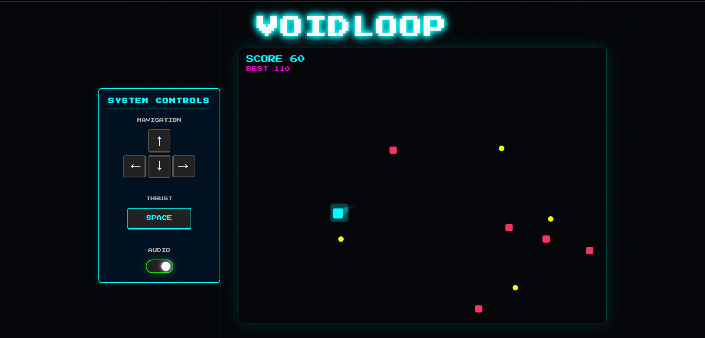

# 🌌 VOIDLOOP


**Voidloop** is a fast-paced, neon-soaked 2D survival arcade game. Dodge enemies, collect energy orbs, and survive as long as possible in the infinite void. 

Built with **JavaScript**, **Phaser 3**, and **Vite**.



## 🎮 Play the Game
ready to survive the void?
### [▶️ Launch Voidloop (Browser)](https://voidloop.vercel.app/)
---

## ✨ Features

* **⚡ High-Octane Gameplay:** Smooth physics-based movement with drag and acceleration.
* **📱 Fully Responsive:** Adaptive layout that works on Desktop, Tablets, and Mobile phones.
* **👆 Touch Controls:** Custom on-screen D-Pad and Action buttons for mobile devices.
* **💾 Local Persistence:** High scores are saved to your browser's local storage.
* **🔊 Audio System:**
    * Seamless background music loop.
    * Retro 8-bit sound effects (Jump, Collect, Explode).
    * Custom-built Neon Toggle Switch for Muting audio.
* **✨ Visuals:** Neon glow effects, particle explosions, and CRT-style aesthetics.

---

## 🕹️ Controls

### Desktop
| Key | Action |
| :--- | :--- |
| **Arrow Keys** | Move Player |
| **Spacebar** | Dash / Thrust |
| **ESC** | Pause / Resume |
| **R** | Restart Game (on Game Over) |

### Mobile / Tablet
* **On-Screen Arrows:** Move Player
* **DASH Button:** Speed Boost
* **Toggle Switch:** Mute/Unmute Audio
* **Tap Screen:** Restart Game (on Game Over)

---

## 🛠️ Installation & Local Development

Want to tweak the code or add new features? Follow these steps:

**1. Clone the repository**
```bash
git clone https://github.com/starzooka/VoidLoop.git
cd voidloop
